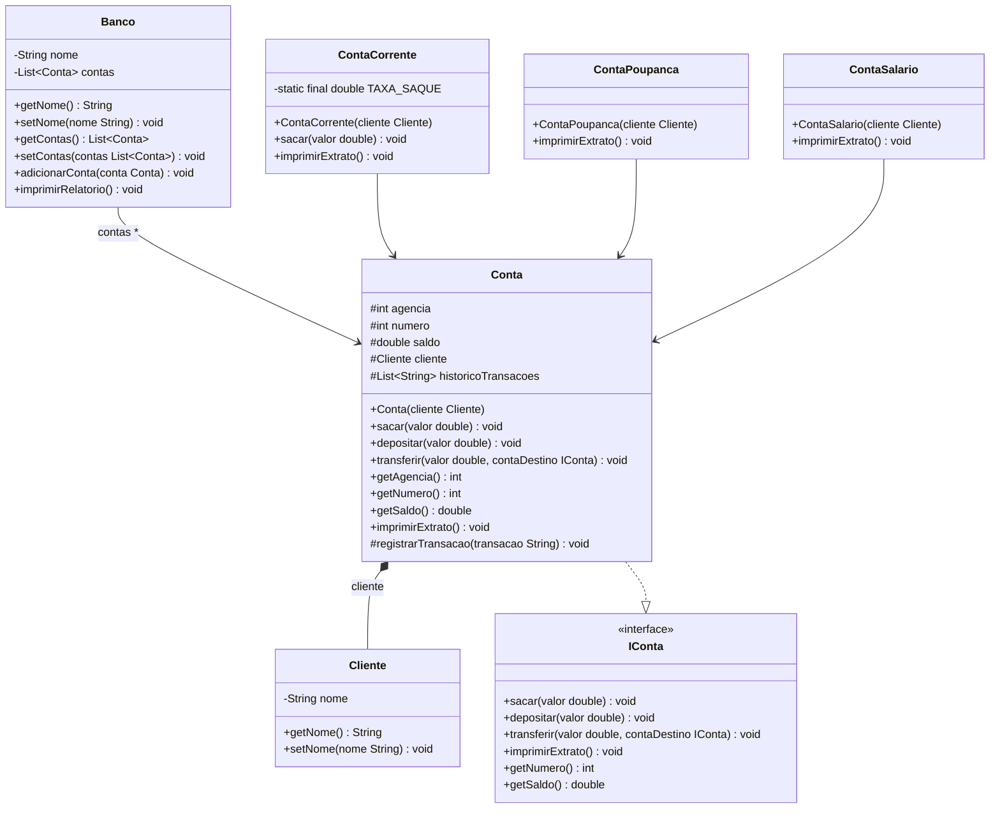

# Banco digital com POO

_Incrementação de abtrações no dominio bancario desenvolvido atráves do [repositorio](https://github.com/falvojr/lab-banco-digital-oo) da [DIO](https://www.dio.me) (Digital Inovation One.)_

### Representação do Dominio Bancario

